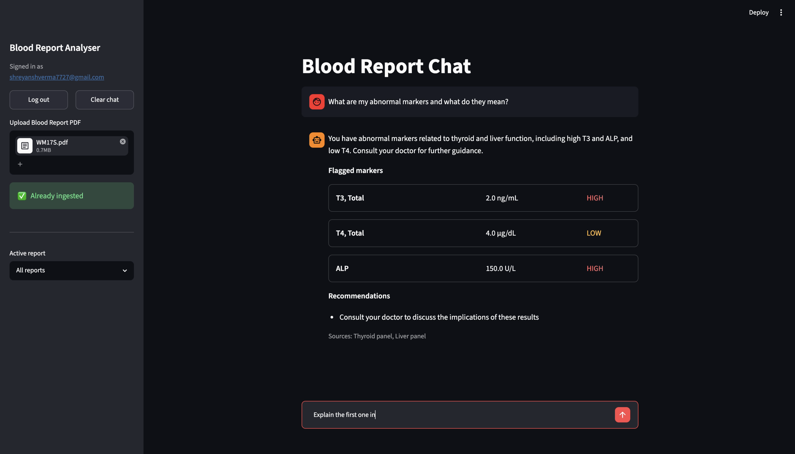

# Blood Report Analyser

A RAG-powered blood report analysis app. Upload a PDF blood report, and chat with it — ask about your abnormal markers, compare values across reports, or look up what a marker means in medical literature.

**Live app:** [Blood Report Analyser](https://blood-report-analyser-agent.streamlit.app/)

---

## Screenshot



## Demo

https://github.com/user-attachments/assets/6ed5a41e-3b5e-4c40-9a57-85420743b7ee

---

## What it does

- **Ingests** blood report PDFs using `pdfplumber` — known lab formats (LPL) go through deterministic regex extraction; everything else falls back to Groq structured extraction, so any lab report with a test/value/range table works
- **Stores** structured marker data (name, value, unit, reference range, flag) in Supabase and embeds panel summaries into Qdrant
- **Chats** via a LangGraph ReAct agent backed by Groq (`llama-3.3-70b-versatile`) with three tools:
  - `query_my_reports` — semantic search over your report panels
  - `compare_reports` — chronological marker comparison across reports
  - `search_medical_kb` — citations from a curated MedlinePlus knowledge base
- **Remembers** conversation history within a session via LangGraph `MemorySaver`

---

## Stack

| Layer | Tech |
|---|---|
| PDF extraction | pdfplumber + regex (LPL) / Groq structured extraction (other labs) |
| Structured storage | Supabase (PostgreSQL) |
| Vector storage | Qdrant Cloud |
| Embeddings | `all-MiniLM-L6-v2` (sentence-transformers) |
| LLM | Groq — llama-3.3-70b-versatile |
| Agent orchestration | LangGraph ReAct |
| Observability | LangSmith |
| UI | Streamlit |

---

## Local setup

```bash
git clone https://github.com/shreyanshverma7/blood-report-analyser.git
cd crewai-blood-report-analyser-bot

python3 -m venv venv && source venv/bin/activate
pip install -r requirements.txt

cp .env.example .env
# Fill in your keys in .env
```

**Required credentials** (all free tiers available):
- [Groq](https://console.groq.com) — `GROQ_API_KEY`
- [Supabase](https://supabase.com) — `SUPABASE_URL`, `SUPABASE_SERVICE_KEY`
- [Qdrant Cloud](https://cloud.qdrant.io) — `QDRANT_URL`, `QDRANT_API_KEY`
- [LangSmith](https://smith.langchain.com) — `LANGCHAIN_API_KEY`

**One-time setup:**

```bash
# Verify all services are reachable
python scripts/smoke_test.py

# Create Supabase tables (paste scripts/create_tables.sql into Supabase SQL Editor)

# Create Qdrant collections
python scripts/setup_qdrant.py

# Embed the medical knowledge base
python -c "from src.kb.loader import load_kb; load_kb()"
```

**Run the app:**

```bash
streamlit run src/ui/app.py
```

---

## Project structure

```
src/
  ingestion/    # PDF parsing, marker extraction, metadata, embedding, pipeline
  agent/        # LangGraph graph, tools, LLM config
  kb/           # Medical KB loader + MedlinePlus source documents
  db/           # Supabase client
  ui/           # Streamlit app
scripts/        # Setup and smoke test scripts
```
